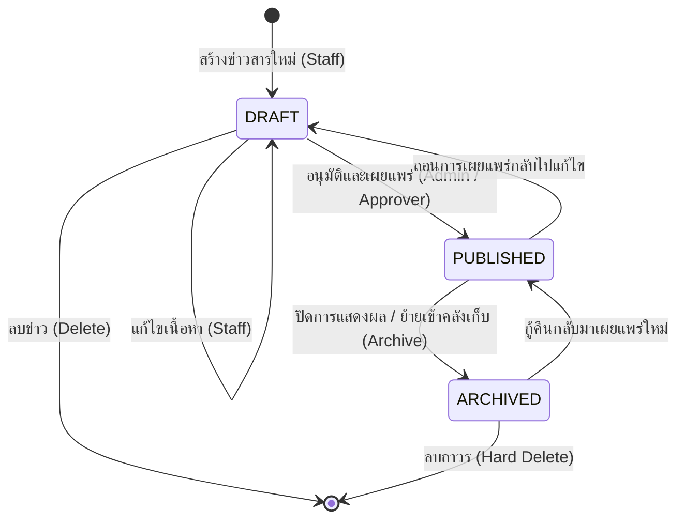

# Technical Architecture & Flow
## Feature: ระบบจัดการข่าวสารประชาสัมพันธ์ (News & PR Management)

---

## 1. โครงสร้างโฟลเดอร์ (Folder Structure)

```
src/
├── features/
│   └── news/
│       ├── index.ts               # Public DTO Types & Client-safe helpers
│       ├── server.ts              # Public Server queries สำหรับ Server Components
│       ├── actions.ts             # Server Actions (Create, Update, Delete, TogglePin, ChangeStatus)
│       ├── permissions.ts         # ทะเบียนสิทธิ์ Permission Constants (news:read, news:manage, news:publish)
│       ├── messages.ts            # พจนานุกรมข้อความสองภาษา (TH/EN)
│       └── _internal/             # โค้ดภายในโมดูล (Private)
│           ├── schemas.ts         # Zod validation schemas
│           └── services/
│               ├── news.service.ts       # Business logic หลัก & Database operations
│               └── news.service.test.ts  # Unit tests
├── app/
│   ├── (admin)/
│   │   └── news/
│   │       ├── page.tsx           # หน้าจัดการข่าวสารหลังบ้าน (Admin Console)
│   │       └── _components/       # Client components สำหรับหน้า Admin
│   │           ├── news-table.tsx
│   │           └── news-dialog.tsx
│   └── (portal)/
│       └── news/
│           ├── page.tsx           # หน้ารายการข่าวสารสาธารณะ (Public Portal)
│           └── [slug]/
│               └── page.tsx       # หน้ารายละเอียดข่าวฉบับเต็ม
```

---

## 2. แผนผังการไหลของสถานะข่าว (News Lifecycle State Machine)



---

## 3. การลงทะเบียนสิทธิ์ (Permission Registry)

ประกาศใน `src/features/news/permissions.ts`:
- `news:read` — สิทธิ์การเข้าดูรายการข่าวสารในระบบหลังบ้าน
- `news:manage` — สิทธิ์การสร้างและแก้ไขข่าวสารฉบับร่าง
- `news:publish` — สิทธิ์การอนุมัติ เผยแพร่ ปักหมุด และลบข่าวสาร

ลงทะเบียนต่อเข้า `src/permissions.ts`:
```ts
import { NEWS_PERMISSIONS } from "@/features/news/permissions";

export const ALL_PERMISSIONS: readonly PermissionDef[] = [
  ...IDENTITY_PERMISSIONS,
  ...SAMPLE_PERMISSIONS,
  ...NEWS_PERMISSIONS,
];
```

---

## 4. Route Mapping

| Route | View | Description | สิทธิ์การเข้าถึง |
| :--- | :--- | :--- | :--- |
| `/news` | Portal | หน้ารวมข่าวสารประชาสัมพันธ์สำหรับบุคคลภายนอก | ทุกคน (Public / Guest) |
| `/news/[slug]` | Portal | หน้ารายละเอียดข่าวฉบับเต็ม | ทุกคน (Public / Guest) |
| `/(admin)/news` | Admin | ตารางจัดการข่าวสารหลังบ้าน | ล็อกอิน + มีสิทธิ์ `news:read` |
