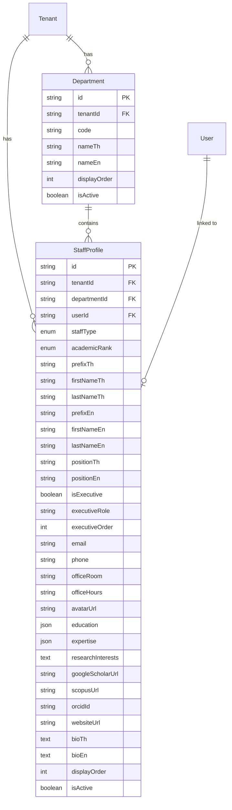
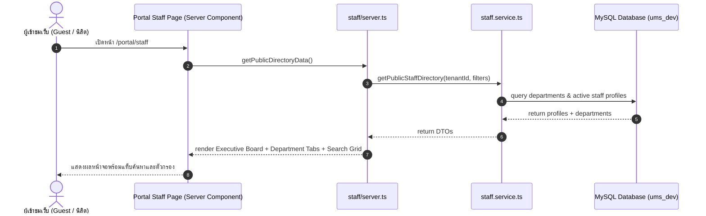
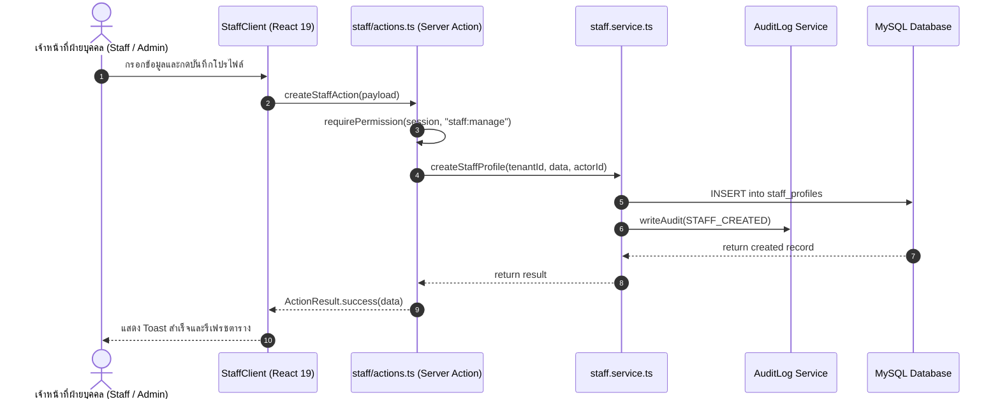

# Technical Architecture & Flow
## Feature: ทำเนียบบุคลากรและอาจารย์ (Faculty & Staff Directory)

---

## 1. โครงสร้างโฟลเดอร์ (Folder Structure)

```
src/
├── features/
│   └── staff/
│       ├── index.ts               # Public DTO Types & Client-safe helpers
│       ├── server.ts              # Public Server queries สำหรับ Server Components
│       ├── actions.ts             # Server Actions (Create, Update, Delete, ToggleActive, Departments)
│       ├── permissions.ts         # ทะเบียนสิทธิ์ Permission Constants (staff:read, staff:manage)
│       ├── messages.ts            # พจนานุกรมข้อความสองภาษา (TH/EN)
│       └── _internal/             # โค้ดภายในโมดูล (Private)
│           ├── schemas/
│           │   └── staff.schema.ts      # Zod validation schemas
│           ├── repositories/
│           │   └── staff.repository.ts  # Prisma Data Access Queries
│           └── services/
│               ├── staff.service.ts      # Business logic หลัก & Database operations
│               ├── staff.service.test.ts # Unit tests (Vitest)
│               └── staff.service.int.test.ts # Integration tests
├── app/
│   ├── (admin)/
│   │   └── staff/
│   │       ├── page.tsx           # หน้าจัดการบุคลากรหลังบ้าน (Admin Console)
│   │       └── _components/       # Client components สำหรับหน้า Admin
│   │           ├── staff-client.tsx
│   │           ├── staff-dialog.tsx
│   │           └── department-dialog.tsx
│   └── portal/
│       └── staff/
│           ├── page.tsx           # หน้ารายชื่อคณาจารย์สาธารณะ (Public Directory)
│           └── [id]/
│               └── page.tsx       # หน้ารายละเอียดโปรไฟล์อาจารย์รายบุคคล (Academic Profile)
```

---

## 2. แผนผังความสัมพันธ์ของข้อมูล (Data Entity Relationships)



---

## 3. Data Flow ของระบบ

### 3.1 การเข้าชมผ่านหน้า Public Portal (`/portal/staff`)


### 3.2 การจัดการบุคลากรใน Admin Console (`/staff`)

